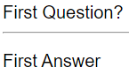
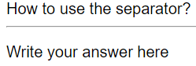
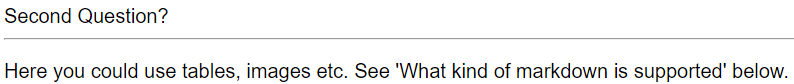
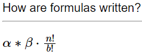

# MarkdownQAGenerator

A GitHub action to generate question-answer style cards from markdown files and converts them to CrowdAnki files, so they can be used with the anki app. (Other formats may be supported in the future as well.)

This action will parse the given Markdown files with a specific layout that is interpreted as questions and answers separated into chapters. See [Markdown file format](#markdown-file-format) for the details on how to create those elements. Based upon this html question answer cards sorted into chapters are created that are then converted to a .json file and media files, so that they can be imported to [Anki](https://apps.ankiweb.net/) via the [CrowdAnki](https://ankiweb.net/shared/info/1788670778) Plugin.


If you want to contribute or just run the actions console application locally please take a look at the notes [here](#how-to-contribute).

:warning: **This GitHub action is still under development and not very well tested!**  Feel free to use it but be advised it may not work as intended. If you encounter any problems, please open an issue so they can be investigated.

## Usage

### Example action

:information_source: **Note:** This action has to use `runs-on: ubuntu-latest`{:.yml} in order to work.

```yml
- name: Generate Anki Questions from Markdown file
  id: question-generator
  uses: HannesZeihsel/MarkdownQAGenerator@V1.1.0
  with:
    markdown-file: './questions/TestMarkdown.md'
    destination-directory: './questions/Generated/'
    root-directory: ${{ './' }}
    deck-name: 'MarkdownQAGenerator Question Deck'
```

You can also pin to a [specific release](https://github.com/peter-evans/create-pull-request/releases) version in the format `@V3.x.x`

### Action inputs

| Name | Description | Required/Default |
| --- | --- | --- |
| `file` | The markdown files to be parsed and converted. In regex format relative to `root-directory` | Required |
| `destination-directory` | The directory in which the generated data is saved to | Required |
| `root-directory` | The root directory at which to start to search for the markdown files. | Default `New Deck` |
| `deck-name` | The name that the root deck (containing all the chapters) should have | Default `New Deck` |

### Action outputs

| Name | Description |
| --- | --- |
| `conversion-stats` | Stats about the conversion (name of chapters and number of questions). Uses `%0A` as line break, so it can be used easily in other actions.|

### Example workflow

In the following example shows how to use the action in a complete workflow
and generate a pull request with the new changes at the end.

```yml
name: 'MarkdownQAGenerator Example'

on:
  push:
    branches: [ master ]
    paths:
    - 'questions/*.md'  #Run only if the Markdown file was changed
  workflow_dispatch:

jobs:
  analysis:
    runs-on: ubuntu-latest

    steps:
    - uses: actions/checkout@v2
        
    - name: Generate Anki Questions from Markdownfile
      id: question-generator
      uses: HannesZeihsel/MarkdownQAGenerator@V1.1.0
      with:
         markdown-file: './questions/*.md'
        destination-directory: ${{ './questions/Generated/' }}
        root-directory: ${{ './' }}
        deck-name: 'MarkdownQAGenerator Question Deck'
      
    # Create a new Pull request
    # Check out https://github.com/peter-evans/create-pull-request
    - name: Create pull request
      uses: peter-evans/create-pull-request@v3.4.1
      with:
        labels: automated
        title: 'Update the generated CrowdAnki file to reflect newest changes'
        body: 'Following chapter where generated: ${{ steps.question-generator.outputs.conversion-stats }}'
        commit-message: 'Generated files for CrowdAnki from MarkdownQAGenerator'
```

To enable automerge on the created pull request check out [this](https://github.com/peter-evans/enable-pull-request-automerge) action. (:information_source: **Note:** You have to use `create-pull-request` without the default `GITHUB_TOKEN`, so that other actions will trigger on the newly created pull request. See [here](https://github.com/peter-evans/create-pull-request/blob/main/docs/concepts-guidelines.md#triggering-further-workflow-runs))

---

## Markdown File Format

### File Structure

The following markdown elements have a special meaning to the converter:

| Element | Example | Meaning |
| --- | --- | --- |
| Top level heading | `# Chapter 1` | The following questions and answer cards will be put into a anki deck named `Chapter 1` under the root deck.|
| Second level heading | `## Question A` | This marks a question that is added to the current anki deck with the answer that follows it (until another special element is used) |
| Separator | `---` | Marks the end of a questions' answer. (Usually just another question or a new chapter is declared) |

:information_source: **Note:** A question needs to be part of a chapter.
The following parts of the document will be ignored if present:

- Any content before the first chapter (_In a future version this might be used as the title or/and description of the root anki deck_)
- Any content between a chapter and the first question (_In a future version this might be used as the description of the anki deck for that chapter_)
- Any content after a separator and the next chapter/question

Any such content will be reported with a warning by the actions output.

## Example File

```md
Ignored Content before first Chapter.

# Chapter 1

Ignored Content between chapter and first question.

## First Question?

First Answer

## Second Question?

Here you could use tables, images etc. See 'What kind of markdown is supported' below.

## How to use the separator?

Write your answer here

---

Write the content to be ignored here. (This will not be part of the answer.)

# Math Deck

## How are formulas written?

$\alpha * \beta \cdot \frac{n!}{b!}$
```

This would generate a root anki deck with two child decks, the first being 'Chapter 1' and the second being 'Math Deck' with the following contents:

Chapter 1:





Math Deck:



### What kind of markdown is supported?

Internally the [`Markdig`](https://www.nuget.org/packages/Markdig/) nuget package is used (with `UseAdvancedExtensions()`), so the features available there (except Emoji, SoftLine as HardLine, Bootstrap, YAML Front Matter, JiraLinks and SmartyPants) are available with this action as well.
Please refer to the GitHub site of the nuget package [here](https://github.com/xoofx/markdig) to get an overview about the features.

However this action is not yet very well tested, so issues may arise (please add a bug report if you encounter any of them).

Additionally the formatting is currently very basic without much extras and configurability.

---

## How to contribute

Feel free to contribute by creating issues, bug reports and feature requests or to make pull requests. Some info/tips to get the code running on your computer (it makes it easier to test than to run the action in GitHub each time you want to test something new).

The project is created as a C# Console Application and you can open the solution file with e.g. Visual Studio. Before the app is started here are a few things to be aware of:

### Setting the Application Arguments

The application parameter have to be specified, just like the GitHub action would pass the inputs of the action.
This can be done via `right-click` on the project in the solution explorer window -> `Properties` -> `Debug` and then add the following to the Application arguments box:

```
"-f" "./TestMarkdown.md" "-d" "./Generated/"
```

The `-f` option is the `markdown-file` option from GitHub and `-d` is for `destination-directory`. If `deck-name` should also be set the parameter name for that is `-n`.

### Using some test data

A basic test file is provided under the folder `Test` with `TestMarkdown.md`. This and the picture `launch.jpg` it uses have to be copied to the generated files after the build of the application is completed. To automate the process the project properties need to be change again. Same way as above, but this time under the build events menu. Here the following should be added to the Post-build event command line box:

```
if $(ConfigurationName) == Debug copy "$(SolutionDir)Test\TestMarkdown.md" "$(OutDir)TestMarkdown.md"

if $(ConfigurationName) == Debug copy "$(SolutionDir)Test\launch.jpg" "$(OutDir)launch.jpg"
```

This will take the two files from the `Test` directory and copy them to the build files.
If other content should be tested in addition this content has to be changed/extended accordingly.
